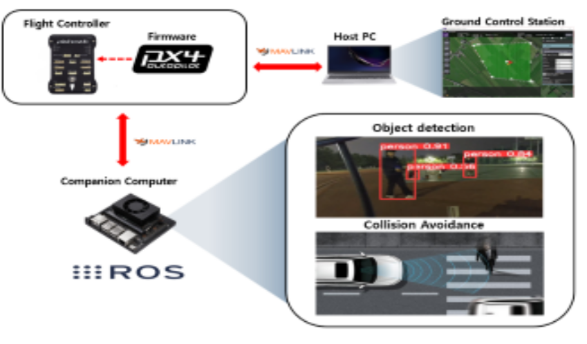
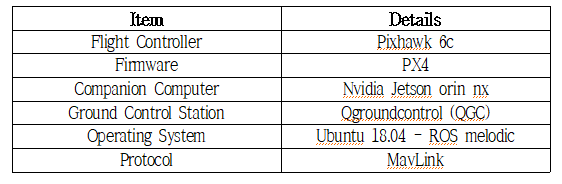

# AI based robot mode control 
This repository is a system that follows a given path in `AUTO.MISSION` when no people or obstacles are detected and stops in `MANUAL` if any are detected. 

## System model and specification


## Quick start
- Run mavros 
```
roslaunch mavros apm.launch
```
- Run yolo 
```
roslaunch yolov5_ros d435_coco.launch
```
- Run orb camera
```
roslaunch astra_camera astra_pro.launch
```

- Run robot mode control
```
roslaunch drone_center keyboard_ctrl.launch
```

- Run image view and select /yolov5/image_out topic
```
rqt_image_view
```

## Result 

